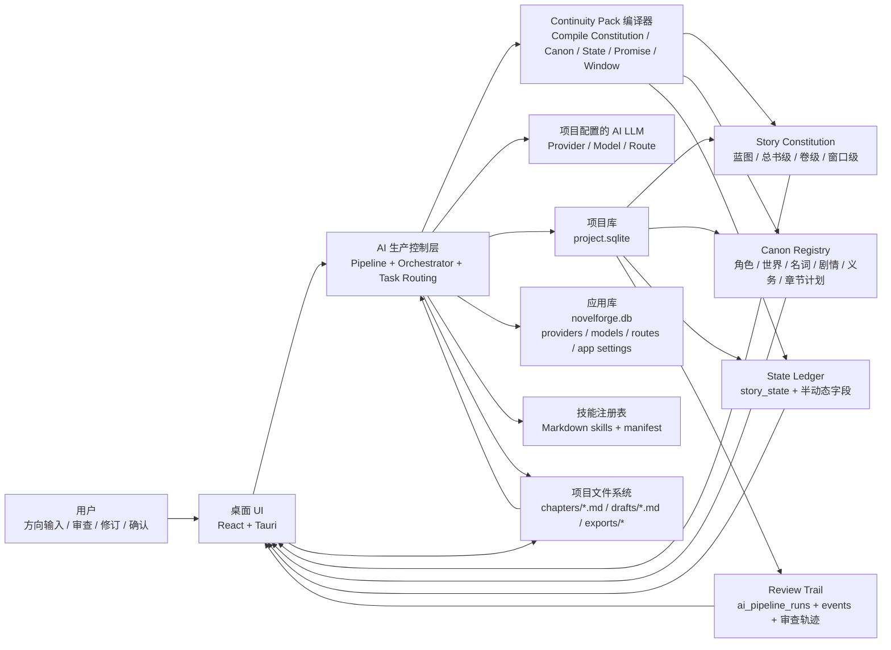
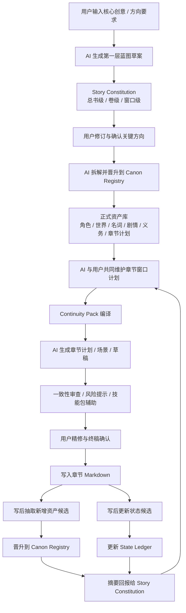
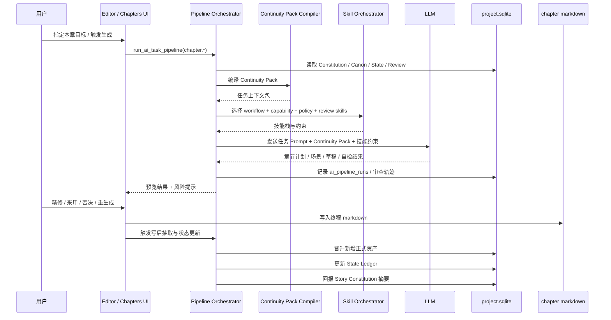
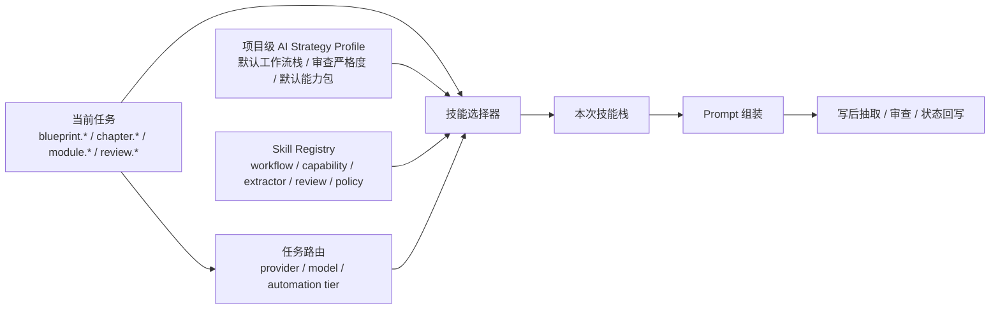
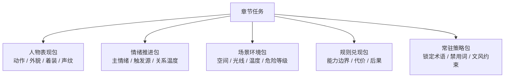
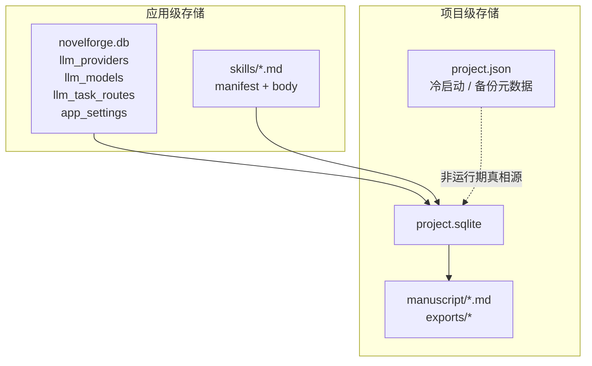
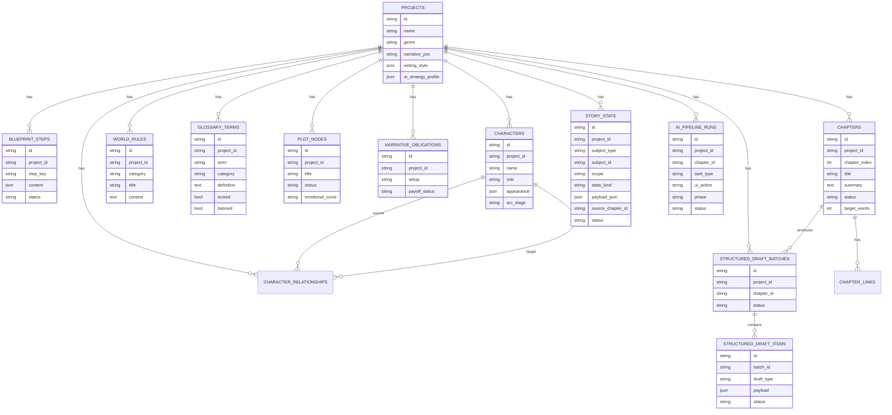
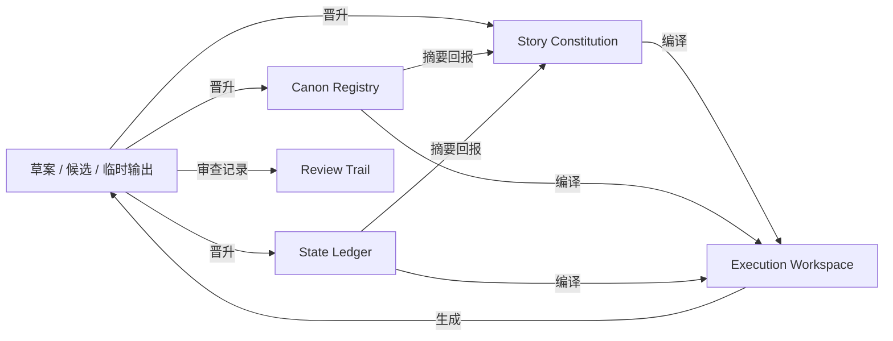

# NovelForge AI 生产系统理想完成态图谱

日期：2026-04-30  
状态：配套图谱文档  
关联主文档：[2026-04-30-ai-production-system-design.md](/F:/NovelForge/docs/superpowers/specs/2026-04-30-ai-production-system-design.md)  
范围：理想完成态的数据流程图、架构图、运行链路图、理想数据结构图  
约束：本图谱使用主 spec 已确认术语，不再引入第二套命名

## 1. 文档目的

这份文档只做一件事：把主 spec 中已经确认的目标机制，压成可执行的结构图。

它回答 5 个问题：

1. 完成态系统在逻辑上由哪些层和对象组成
2. 生产数据从创意到正文、再到资产和状态回写，完整怎么流
3. 单次章节生成在运行期到底经过哪些链路
4. 技能系统在运行期如何参与 AI 生产而不是只做 Prompt 模板
5. 理想完成态下，应用库、项目库、文件系统和技能文件之间怎样分工

---

## 2. 完成态总览

完成态系统遵循 5 个逻辑对象：

1. `Story Constitution`
2. `Canon Registry`
3. `State Ledger`
4. `Execution Workspace`
5. `Review Trail`

系统中的核心动作只有 3 个：

1. `晋升（Promotion）`
2. `回报（Feedback）`
3. `编译（Compile）`

系统中的自动化控制只有 3 档：

1. `自动档（auto）`
2. `监督档（supervised）`
3. `确认档（confirm）`

---

## 3. 权威层与物理存储对照表

| 逻辑对象 | 逻辑职责 | 理想物理载体 | 运行期权威源 | 典型写入方式 |
| --- | --- | --- | --- | --- |
| Story Constitution | 总书/卷级/窗口级方向与不可漂移约束 | `project.sqlite` 中的蓝图相关表 | 项目库 | AI 生成草案 + 用户修订/确认 |
| Canon Registry | 正式成立的角色、设定、术语、剧情、章节计划 | `project.sqlite` 正式业务表 | 项目库 | AI 晋升 + 用户审查/修订 |
| State Ledger | 当前状态快照与增量变化 | `project.sqlite.story_state` | 项目库 | AI 自动更新 + 用户纠偏 |
| Execution Workspace | 单次任务运行期上下文包 | 内存态编译结果 | 编译器输出 | 每次任务前编译 |
| Review Trail | AI 推进与人工干预轨迹 | `ai_pipeline_runs` + 事件流 + 后续必要扩展 | 项目库审计层 | 运行自动记录 |
| App AI Config | Provider / Model / Route / App 级设置 | `~/.novelforge/novelforge.db` | 应用库 | 设置页管理 |
| Skill Registry | 技能 manifest + Prompt 正文 | Markdown 技能文件 | 技能文件系统 | 技能管理页维护 |
| Manuscript Files | 正文章节与草稿恢复 | `manuscript/chapters/*.md` / `manuscript/drafts/*.md` | 文件系统 | 编辑器与写入服务 |

---

## 4. 理想完成态架构图

**图意**

1. 应用级 AI 能力与项目级创作数据分离  
2. 运行期任务不直接拼接表字段，而先经过 `Continuity Pack` 编译  
3. 用户不承担主要生产，但始终持有审查、修订、确认权  
4. 正文章节仍然以 Markdown 文件作为执行载体  

---

## 5. 理想完成态工作数据流程图

**图意**

1. 蓝图不是终点，是第一层方向母板  
2. 第二层正式资产和状态层在正文写后持续增长  
3. 第一层不回收全量明细，只接收摘要化回报  
4. 章节窗口计划始终由蓝图、资产、状态共同驱动  

---

## 6. 章节生成运行链路图

**图意**

1. 单次章节生成的真正核心不是“LLM 调一次”，而是“编译上下文 + 技能栈编排 + 写后回写”  
2. 用户主要在结果审查、细修、采用节点介入  
3. `Review Trail` 必须贯穿整条链，不是末尾补日志  

---

## 7. 技能编排运行链路图

### 7.1 技能五分类在运行期的职责

| 技能类 | 作用阶段 | 主要职责 |
| --- | --- | --- |
| workflow | 主任务阶段 | 定义蓝图生成、章节生成、模块生成等主流程 |
| capability | 生成阶段 | 提供人物动作、外貌服装、情绪、场景、规则兑现等细粒度能力 |
| extractor | 写后阶段 | 从正文或结果中抽取新增资产与状态变化 |
| review | 审查阶段 | 做一致性、状态、逻辑、风格、命名约束检查 |
| policy | 常驻阶段 | 注入术语锁定、禁用词、文风约束、视角约束、底线规则 |

### 7.2 技能包示意

**图意**

1. 技能不是平铺按钮，而是按任务动态装配  
2. 细节类技能不仅影响文本输出，还应参与状态回写和审查  
3. 项目级 AI 策略决定默认技能栈，任务路由决定实际模型和自动化档位  

---

## 8. 理想完成态数据结构图

### 8.1 物理存储分层图

### 8.2 项目库理想数据结构图

### 8.3 理想权威流图

**图意**

1. `Execution Workspace` 是编译结果，不是长期存储层  
2. `State Ledger` 与 `Canon Registry` 平行，不是附属备注  
3. `Review Trail` 是横切审计对象，记录草案到正式权威的演变过程  

---

## 9. 完成态运行原则

### 9.1 AI 是主流生产力

- 蓝图生成、模块生成、章节生成、写后抽取、状态维护、审查提示都默认由 AI 推进
- 用户不承担机械式逐条录入

### 9.2 用户拥有关键监督权

- 用户可以审查结果摘要
- 用户可以精修关键内容
- 用户可以确认或否决高风险晋升
- 用户可以随时回看 Review Trail

### 9.3 第一层只管方向，不管全量细节

- 第一层接收摘要回报
- 第二层承载正式事实
- 状态层承载“现在发生了什么”
- 第三层只负责本章执行

### 9.4 技能系统必须和数据层联动

- 人物动作/服装/外貌/情绪技能不仅影响文本，还要回写状态
- 场景环境技能不仅影响描写，还要回写环境状态
- Policy 技能必须进入 Continuity Pack，不能只留在文案层

---

## 10. 与实现计划的接口

这份图谱文档不是单独实现计划。  
它是后续实施拆解时的结构基准。

后续实现计划必须以这 6 个落点为主轴：

1. `项目级 AI Strategy Profile`
2. `autoPersist 入口收口与分级`
3. `State Ledger`
4. `Continuity Pack Compiler`
5. `Skill Orchestrator`
6. `Review Trail 扩展`

如果后续实现计划偏离这 6 个主轴，说明实现边界已经开始漂移。
