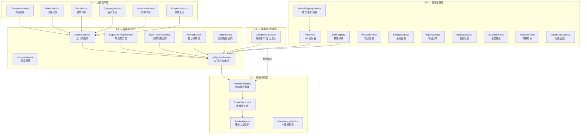
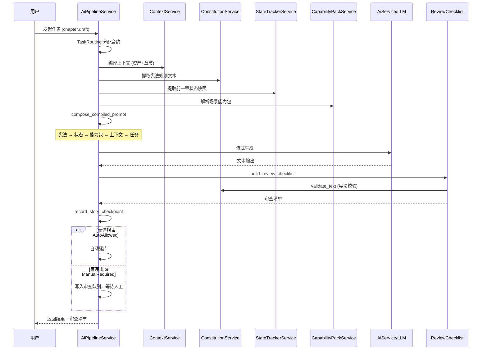
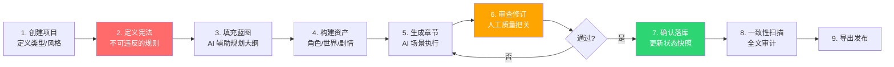

# NovelForge — 分层长篇创作系统 全局架构总览

> NovelForge 是一个由**项目级 AI 策略驱动**、以 **AI 作为主流推进生产力**、以**用户审查、修订、确认权**作为安全与质量控制机制的分层长篇创作系统。

---

## 一、系统五层架构



---

## 二、各层功能模块详解

### L1 — 故事宪法约束层（最高权威）

| 模块 | 后端服务 | 前端页面 | 核心职责 |
|------|----------|----------|----------|
| 宪法引擎 | `ConstitutionService` | `ConstitutionPage` | 定义"必须/禁止/建议"规则，按分类管理，支持启用/禁用 |

**工作机制**：
1. 用户在宪法页面定义规则（如"主角不得在第 10 章前知道真相"）
2. Pipeline 执行时，`collect_rules_for_prompt` 将活动规则注入系统提示词（最高优先级）
3. 生成完成后，`build_review_checklist` 自动调用 `validate_text` 校验输出
4. 违规项写入审查队列，触发阻断

> [!IMPORTANT]
> 宪法层是整个系统的"根权威"——它约束 AI 的行为边界，而非仅仅提供参考信息。

---

### L2 — 正式资产层（结构化知识库）

| 模块 | 后端服务 | 前端页面 | 核心职责 |
|------|----------|----------|----------|
| 角色工坊 | `CharacterService` | `CharactersPage` | 角色 CRUD、AI 生成角色、身份/动机/缺陷结构化 |
| 世界设定 | `WorldService` | `WorldPage` | 世界规则/地点/组织/道具、约束等级分类 |
| 剧情骨架 | `PlotService` | `PlotPage` | 情节节点、冲突定义、排序 |
| 名词术语 | `GlossaryService` | `GlossaryPage` | 锁定术语 + 禁用术语管理 |
| 叙事义务 | `NarrativeService` | `NarrativePage` | 伏笔/承诺/义务追踪 |
| 创作蓝图 | `BlueprintService` | `BlueprintPage` | 分步规划、AI 生成步骤、完成度追踪 |

**工作机制**：
- 资产通过前端页面手动创建或由 AI 自动生成（`asset-building-pack` 能力包）
- `ContextService` 在每次 AI 任务前自动收集相关资产编入上下文
- 资产是"已确认的事实"——AI 必须在这些事实基础上工作

---

### L3 — 场景执行层（AI 生产核心）

| 模块 | 后端服务 | 前端页面 | 核心职责 |
|------|----------|----------|----------|
| 章节管理 | `ChapterService` | `ChaptersPage` / `EditorPage` | 章节 CRUD、内容编辑、版本快照、卷管理 |
| AI 流水线 | `AiPipelineService` | — (事件驱动) | 全链路编排：验证→编译→路由→生成→审查→落库 |
| 上下文编译 | `ContextService` | — (内部) | 收集全局+章节上下文，编译为 AI 可消费的 JSON Manifest |
| 能力包 | `CapabilityPackService` | — (内部) | 根据任务合约动态组装描写密度/情感基调/叙事节奏 |
| 状态追踪 | `StateTrackerService` | `StateTrackerPage` | 章节级状态快照（角色/情节/世界），自动注入前一章状态 |
| 提示词构建 | `PromptBuilder` | — (内部) | 技能模板解析、变量替换 |
| 任务路由 | `TaskRouting` | — (内部) | 16 种任务类型 → 合约分配（权威层/状态层/能力包/审查门） |

**工作机制 — 完整 Pipeline 流**：



---

### L4 — 审查闭环层（质量门控）

| 模块 | 后端服务/逻辑 | 前端页面 | 核心职责 |
|------|---------------|----------|----------|
| 自动审查 | `build_review_checklist` | — (Pipeline 内部) | 禁用词检查、宪法验证、产出完整度、场景纹理分析 |
| 故事检查点 | `record_story_checkpoint` | — (Pipeline 内部) | 每次 AI 生成后记录完整快照（合约/上下文/审查/落库记录） |
| 审查工单 | `ai_review_queue` 表 | `ReviewBoardPage` | 待审项管理：通过/驳回操作 |
| 一致性扫描 | `ConsistencyService` | `ConsistencyPage` | AI 驱动的全文一致性审计 |

**工作机制**：
1. 每次 AI 生成结束后，自动运行 4 类检查（禁用词 / 宪法 / 长度 / 纹理）
2. `status == "attention"` 的项目写入审查队列
3. 用户在 `ReviewBoardPage` 审查→通过/驳回
4. 只有通过审查的内容才算"正式产出"

> [!TIP]
> `ReviewGateMode` 控制审查门严格程度：
> - `ManualRequired` — 章节生成、一致性扫描（必须人工审查）
> - `ManualRecommended` — 资产创建（建议审查，可自动落库）
> - `AutoAllowed` — 预留（目前未启用）

---

### L5 — 基础设施层（平台支撑）

| 模块 | 后端服务 | 前端页面 | 核心职责 |
|------|----------|----------|----------|
| LLM 适配器 | `AiService` | — | 多供应商 LLM 统一接口（流式/非流式） |
| 模型注册 | `ModelRegistryService` | `SettingsPage` | 供应商/模型配置、任务路由绑定 |
| 技能系统 | `SkillRegistry` | `SettingsPage` | .md 格式的可扩展 AI 技能（内置 + 用户自定义） |
| 项目管理 | `ProjectService` | `ProjectCenterPage` | 项目创建、打开、元数据、写作风格配置 |
| 全局设置 | `SettingsService` | `SettingsPage` | API Key、语言、主题等 |
| 导出引擎 | `ExportService` | `ExportPage` | Markdown/TXT/DOCX 等格式导出 |
| 备份恢复 | `BackupService` / `ImportService` | — | 项目备份与恢复 |
| 全文搜索 | `SearchService` | — | SQLite FTS 全文检索 |
| 向量检索 | `VectorService` | — | 语义相似度检索 |
| 仪表盘 | `DashboardService` | `DashboardPage` | 项目统计、AI 诊断、快捷操作 |
| 时间线 | — | `TimelinePage` | AI 驱动的时间线审计 |
| 关系图 | — | `RelationshipsPage` | AI 驱动的角色关系发现 |

---

## 三、任务合约矩阵

系统通过 `TaskRouting` 将 16 种任务类型映射到 4 个维度的执行合约：

| 任务类型 | 权威层 | 状态层 | 能力包 | 审查门 |
|----------|--------|--------|--------|--------|
| `chapter.draft` / `.continue` / `.rewrite` / `.plan` / `prose.naturalize` | SceneExecution | DynamicScene | scene-production-pack | **ManualRequired** |
| `character.create` / `world.create_rule` / `plot.create_node` / `glossary.create_term` / `narrative.create_obligation` | FormalAssets | Asset | asset-building-pack | ManualRecommended |
| `blueprint.generate_step` | StoryConstitution | Constitution | blueprint-planning-pack | ManualRecommended |
| `consistency.scan` / `timeline.review` / `relationship.review` / `dashboard.review` / `export.review` | ReviewAudit | Review | review-guard-pack | **ManualRequired** |

---

## 四、提示词注入优先级

编译后的系统提示词严格按以下顺序排列，优先级从高到低：

```
┌─────────────────────────────────┐
│ 1. 生产系统协议头                 │  身份声明 + 合约参数
├─────────────────────────────────┤
│ 2. 故事宪法规则                   │  最高权威，不可违反
├─────────────────────────────────┤
│ 3. 动态状态快照                   │  前一章的角色/情节/世界状态
├─────────────────────────────────┤
│ 4. 场景能力包                     │  描写密度/情感/节奏参数
├─────────────────────────────────┤
│ 5. 上下文编译清单 (JSON)          │  全局+章节相关资产
├─────────────────────────────────┤
│ 6. 任务提示                       │  用户的具体指令
└─────────────────────────────────┘
```

---

## 五、当前缺口与精简建议

### 已实现但可精简的模块

| 模块 | 现状 | 建议 |
|------|------|------|
| `DashboardService` | 仅统计数据 | ✅ 保持现状，轻量合理 |
| `CapabilityPackService` | 4 个硬编码预设包 | ✅ 当前足够，后续可改为数据库配置 |
| `StateTrackerService` | 手动+自动快照 | ⚠️ Pipeline 结束后应自动触发快照创建（目前仅注入，未自动创建） |

### 已实现但建议加强的功能

| 缺口 | 层级 | 影响 | 建议 |
|------|------|------|------|
| Pipeline 自动创建状态快照 | L3 | 状态追踪依赖手动创建 | 在 `run_pipeline_inner` 的 chapter 任务完成后自动调用 `create_snapshot` |
| 宪法规则 AI 辅助生成 | L1 | 用户需要手动编写规则 | 新增 `constitution.suggest` 任务类型，AI 根据已有资产建议规则 |
| 审查驳回后的重跑机制 | L4 | 驳回后无自动重新生成通道 | `ReviewBoardPage` 增加"重新生成"按钮，携带驳回原因作为额外约束 |
| 资产候选自动确认流 | L2 | AI 发现的资产候选需要手动逐个确认 | 批量确认 + 置信度阈值自动确认 |

### 尚未实现但系统完整性需要的功能

| 缺口 | 层级 | 优先级 | 说明 |
|------|------|--------|------|
| 创作工作流引导 | L3 | 🔴 高 | 新用户缺少"从蓝图→资产→章节"的引导流程，Dashboard 可增加"下一步建议" |
| 章节间连续生产 | L3 | 🔴 高 | 当前每章独立触发，缺少"批量生成下 N 章"的连续生产模式 |
| 生产进度总览 | L4 | 🟡 中 | 需要一个全局视图展示：哪些章节已生成/待审查/已确认 |
| 资产变更历史 | L2 | 🟡 中 | 角色/世界设定被 AI 修改后缺少变更审计轨迹 |
| 宪法冲突检测 | L1 | 🟢 低 | 多条宪法规则之间可能存在矛盾，可增加交叉验证 |

---

## 六、推荐的创作工作流

这是系统设计所期望的长篇小说生产流程：



---

## 七、总结

NovelForge 的分层架构确保了：

| 原则 | 实现方式 |
|------|----------|
| **AI 在正确的权威层运作** | `TaskRouting` 为每个任务分配 `StoryAuthorityLayer` |
| **AI 在正确的状态层推进** | `ContextService` + `StateTrackerService` 提供实时上下文 |
| **AI 调用正确的能力包** | `CapabilityPackService` 按任务类型动态组装 |
| **审查闭环才进入下一阶段** | `ReviewChecklist` + `ReviewQueue` + `ReviewBoardPage` |
| **宪法是最高约束** | 注入最高优先级 + 输出自动验证 + 违规阻断 |

系统的核心不是"让 AI 写更多"，而是**让 AI 在正确的结构中持续推进生产**。
